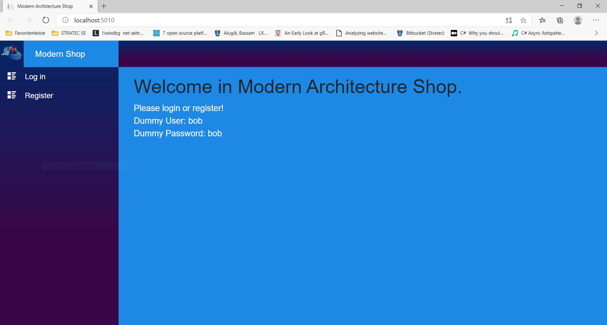
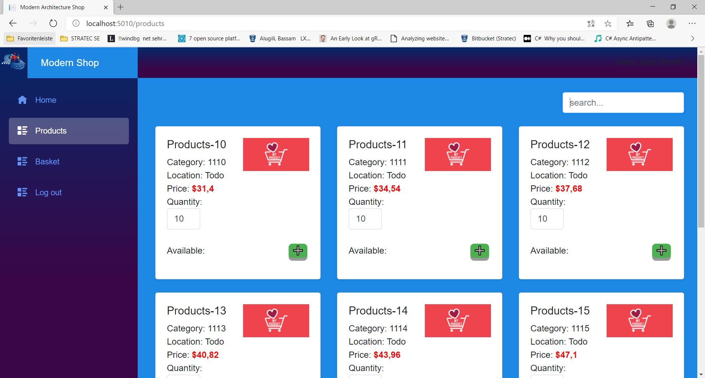
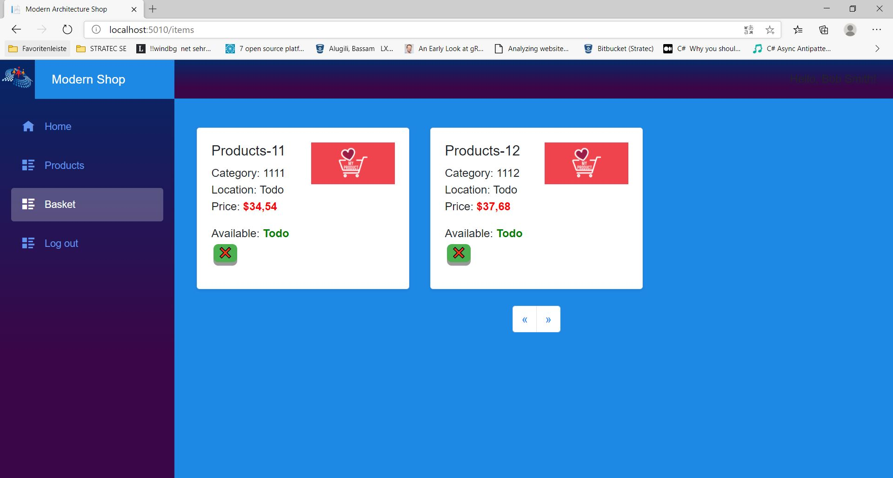
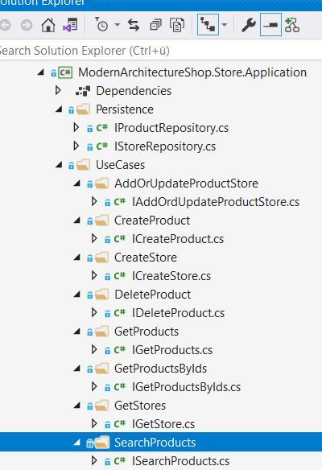
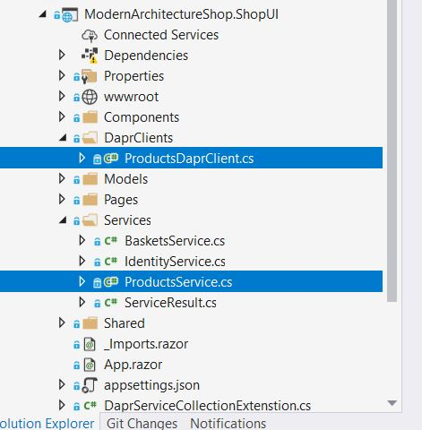

# [Quick Start](https://github.com/alugili/ModernArchitectureShop/wiki/QuickStart)
# [Modern Architecture Shop Part I(First Article)](https://github.com/alugili/ModernArchitectureShop/wiki/Modern-Architecture-Shop-Article-Part-I)

Modern Architecture Shop - Autoscaler
======================
Modern Architecture Shop is a clean-lightweight .NET Microservices application, demonstrating the use of **Dapr** to build Microservices-based applications.
 
Open Invitation: Any developer is welcome to join our team! Just send me a request.
 
**The application UI**  




 
The implemented application architect is still based on the classic Microservices architectural style; we have a collection of DDD-services, which are working together to build the system.  
 

 
The diagram above is created with Draw.io. Draw.io is a free online diagram software.  
 
**Roadmap**  

- Finishing the Order and Payment services.
- The first challenge is scaling the application out. I give an example which provides Proof of the Concept for containers scaling and testing the system with Chaos Monkey Tests.
- Changing the services to Actors with a scaling concept.
- Finally, using KEDA. KEDA is a Kubernetes-based Event-Driven Autoscaler (Horizontal Pod Autoscaler)

**Modern Architecture Shop**  

In this version, I have done more clean architecture and clean code stuff:
- I have separated the application from the Infrastructure.
- Use Cases are moved into the application.
- The Persistence abstraction moved to the application.

In the example below, you can see that the Store application contains the business logic abstraction.



The framework's references moved to the infrastructure assembly. If you remember in, pervious article, our main goal was to make the infrastructure depending on the application.
 
In addition, I have added the Orders Domain Events. These events are working together on the use cases to build a single coherent system.
 
**ProcessOrder Event**  

The event is fired when the user clicks on the buy button.
 
**PayOrder Event**  

This event creates the order so that it can be sent to the Payment Service. After that, the payment can succeed or fail.
 
**PrdocutsSold Event**  

The event is fired when the payment is successful. This event helps to update the products availability in the Store.
 
**PaymentConfirmed Event**  

The event is fired when the payment has been successful. This event is responsible to remove the processed order and basket information.
 
**PaymentFailed Event**  

The event is fired when the payment fails. This event is used to remove the failed order data and to reactive the buy state in the Basket service.
 
**ModernArchitectureShop.ShopUI**  


 
As you see in the image above, I have selected ProductsService and ProductsDaprClient, these two classes are equivalent, both are calling the Store API, but they are using two different approaches, the Product API is using HTTPClient to call the Store API and the other one is using DaprCilent.  

```cs
public class ProductsService    
{    
    private readonly HttpClient _storeHttpClient;    
    private readonly IHttpContextAccessor _httpContextAccessor;    
    
    public ProductsService(HttpClient storeHttpClient, IHttpContextAccessor httpContextAccessor)    
    {    
        _storeHttpClient = storeHttpClient ?? throw new ArgumentNullException(nameof(storeHttpClient));    
        _httpContextAccessor = httpContextAccessor ?? throw new ArgumentNullException(nameof(httpContextAccessor));    
    }    
    
    public async Task AttachAccessTokenToHeader()    
    {    
        var accessToken = await _httpContextAccessor.HttpContext.GetTokenAsync("access_token");    
        if (accessToken != null)    
        {    
            var auth = _storeHttpClient.DefaultRequestHeaders.Authorization?.Parameter;    
            if (auth == null)    
                _storeHttpClient.DefaultRequestHeaders.Add("Authorization", "Bearer " + accessToken);    
        }    
    }    
    
    public async Task<ServiceResult<string>> SearchProducts(string url)    
    {    
        await AttachAccessTokenToHeader();    
    
        HttpResponseMessage response;    
        try    
        {    
            response = await _storeHttpClient.GetAsync(url);    
            response.EnsureSuccessStatusCode();    
        }    
        catch (HttpRequestException e)    
        {    
            return new ServiceResult<string>    
            {    
                Content = null!,    
                StatusCode = 500, // Server Error!    
                Error = e.Message    
            };    
        }    
    
        return new ServiceResult<string>    
        {    
            Content = await response.Content.ReadAsStringAsync(),    
            StatusCode = (int)response.StatusCode,    
            Error = string.Empty    
        };    
    
    }    
    
    public async Task<ServiceResult<string>> GetProductsAsync(string url)    
    {    
        await AttachAccessTokenToHeader();    
    
        HttpResponseMessage response;    
        try    
        {    
            response = await _storeHttpClient.GetAsync(url);    
            response.EnsureSuccessStatusCode();    
        }    
        catch (HttpRequestException e)    
        {    
            return new ServiceResult<string>    
            {    
                Content = null!,    
                StatusCode = 500, // Server Error!    
                Error = e.Message    
            };    
        }    
    
        return new ServiceResult<string>    
        {    
            Content =  await response.Content.ReadAsStringAsync(),    
            StatusCode = (int)response.StatusCode,    
            Error = string.Empty    
        };    
    }    
}
```

```cs
public class ProductsDaprClient    
{    
    private readonly DaprClient _daprClient;    
    
    public ProductsDaprClient(DaprClient daprClient)    
    {    
        _daprClient = daprClient;    
    }    
    
    public async Task<GetProductsResponse> GetProductsAsync(    
        string url,    
        GetProductsCommand getProductsCommand,    
        CancellationToken cancellationToken)    
    {    
        return await this._daprClient.    
                  InvokeMethodAsync<GetProductsCommand, GetProductsResponse> ("storeapi",  url, getProductsCommand,    
                  new HTTPExtension { Verb = HTTPVerb.Get },    
                  cancellationToken);    
    }    
    
    public async Task<GetProductsResponse> SearchProductsAsync(    
        string url,    
        SearchProductsCommand searchProductsCommand,    
        CancellationToken cancellationToken)    
    {    
        return await this._daprClient.    
            InvokeMethodAsync<SearchProductsCommand, GetProductsResponse>    
            ("storeapi",    
                url,    
                searchProductsCommand,    
                new HTTPExtension { Verb = HTTPVerb.Get },    
                cancellationToken);    
    }    
    
    public class GetProductsCommand    
    {    
        public int PageIndex { get; set; } = 1;    
    
        public int PageSize { get; set; } = 10;    
    }    
    
    public class GetProductsResponse    
    {    
        public int TotalOfProducts { get; set; }    
        public IEnumerable<ProductModel> Products { get; set; } = new ProductModel[0];    
    }    
    
    public class SearchProductsCommand    
    {    
        public string Filter { get; set; } = string.Empty;    
    
        public int PageIndex { get; set; } = 1;    
    
        public int PageSize { get; set; } = 10;    
    }    
}
```

You can get the products with Dapr as following:   

```cs
// Do it with Dapr  
try    
{    
  ProductsDaprClient.GetProductsResponse products =    
    await ProductsDaprClient.GetProductsAsync("api/products",    
      new ProductsDaprClient.GetProductsCommand { PageIndex = Page, PageSize = _pageSize },    
      new CancellationToken());    
    
  _productsModel = new ProductsModel { Products = products.Products.ToList(), TotalOfProducts = products.TotalOfProducts };    
}    
catch (Exception e)    
{    
  // Todo just for Developers!    
  _errorMessage = $"Error: {e.Message}";    
  _productsModel = new ProductsModel(); ;    
}`
    
`// Alternatively, do it with HTTP classic    
var response = await ProductsService.GetProductsAsync(ProcessUrl());    
    
if (response.StatusCode == (int)System.Net.HttpStatusCode.OK)    
{    
  _productsModel = JsonSerializer    
                                 .Deserialize<ProductsModel>(response.Content,    
                                                            new JsonSerializerOptions { PropertyNameCaseInsensitive = true });    
}    
else    
{    
  _errorMessage = $"Error: {response.Error}";    
  _productsModel = new ProductsModel();    
}
```

**How can you test the modern shop?**
  
**Required**   

https://docs.microsoft.com/en-us/visualstudio/releases/2019/release-notes-preview Visual Studio 2019
https://www.docker.com/products/docker-desktop Docker Desktop

**First Approach with Visual Studio**   

Build and Start the Shop

1. Install tye
`dotnet tool install -g Microsoft.Tye --version "0.5.0-*" --add-source https://pkgs.dev.azure.com/dnceng/public/_packaging/dotnet5/nuget/v3/index.json`

2. Start tye-min.yaml in console
`tye run tye-min.yaml`

3. Open the solution file **ModernArchitectureShop.sln** with latest Visual Studio 2019 preview.
 
4. Set the Startup projects as shown below
 

 
5. PRESS **F5** and enjoy it!   
 
**The Second Approach run the Shop with Dapr**   
Alternatively, to Visual Studio 2019
 
1. Install Tye   
`dotnet tool install -g Microsoft.Tye --version "0.5.0-*" --add-source https://pkgs.dev.azure.com/dnceng/public/_packaging/dotnet5/nuget/v3/index.json`

2. Start tye-min.yaml in the console
`tye run tye-min.yaml`

3. Install Dapr   
`powershell -Command "iwr -useb https://raw.githubusercontent.com/dapr/cli/master/install/install.ps1 | iex"`

4. Execute dapr_start.ps1 in the PowerShell    
`./dapr_start.ps1`

**Third Approach run it with Tye**

1. Tye install    
 
This will install the newest available build from our CI.    

`dotnet tool install -g Microsoft.Tye --version "0.5.0-*" --add-source https://pkgs.dev.azure.com/dnceng/public/_packaging/dotnet5/nuget/v3/index.json`

If you already have a build installed and you want to update, replace install with update    
`dotnet tool update -g Microsoft.Tye --version "0.5.0-*" --add-source https://pkgs.dev.azure.com/dnceng/public/_packaging/dotnet5/nuget/v3/index.json`

2. Execute the tye command     
`tye run`   

**Summary**  

Modern Architecture Shop is a clean-lightweight .NET and scalable application. Keep your eye on the Road Map (watch it on GitHub). The next version will contain a minimal feature set so that the user can add products to the basket and pay it. Recommendation service and all other AI services or features, I provide them later.
