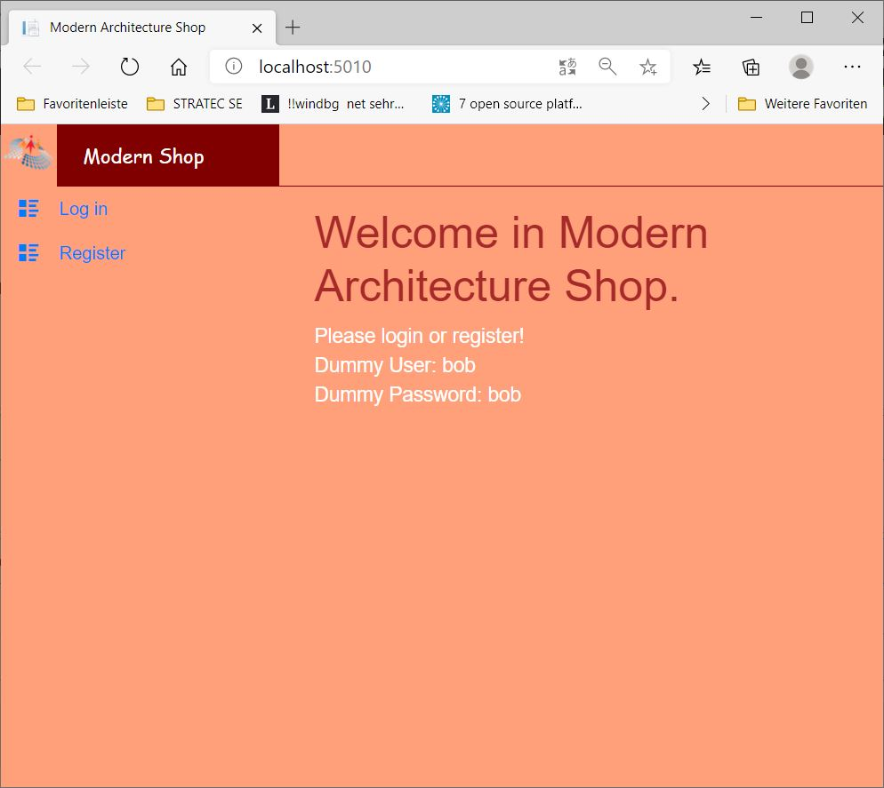
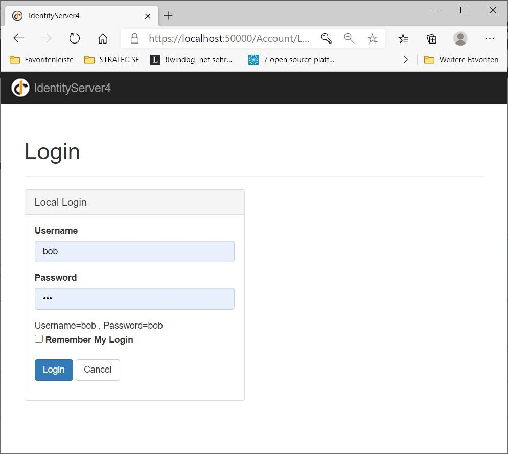
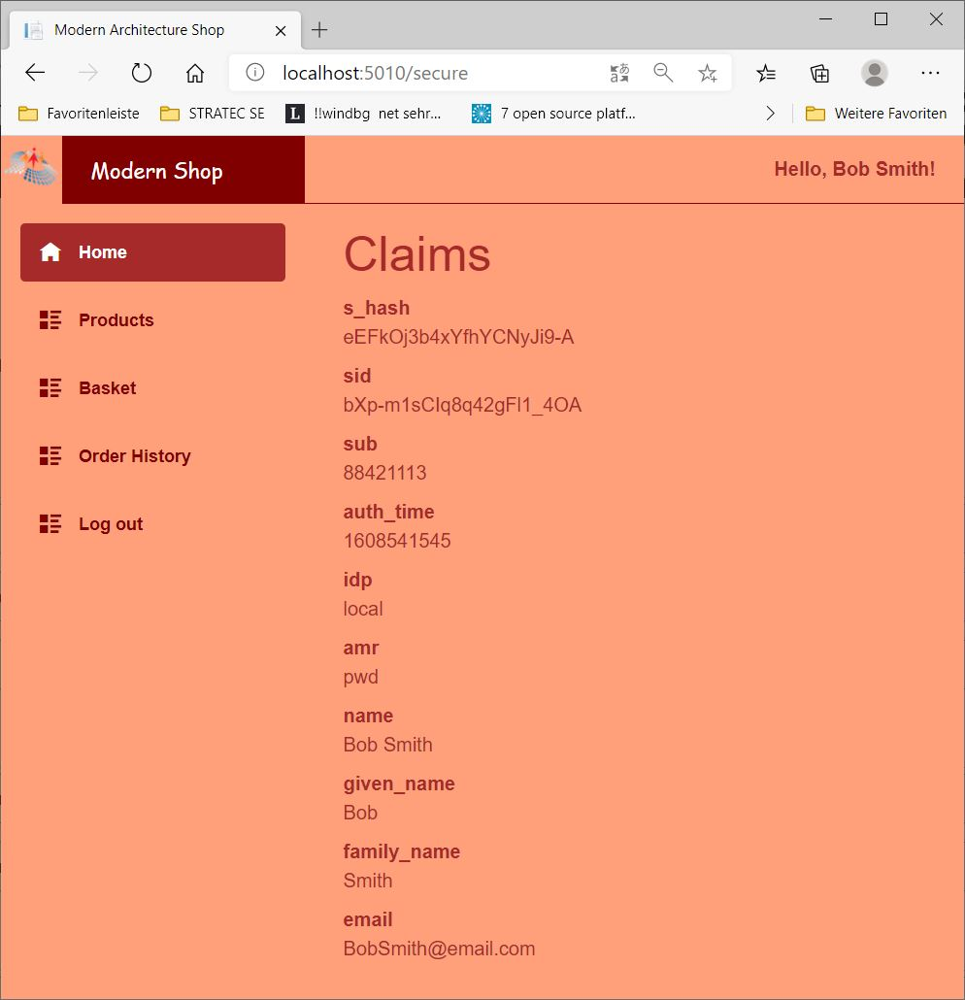
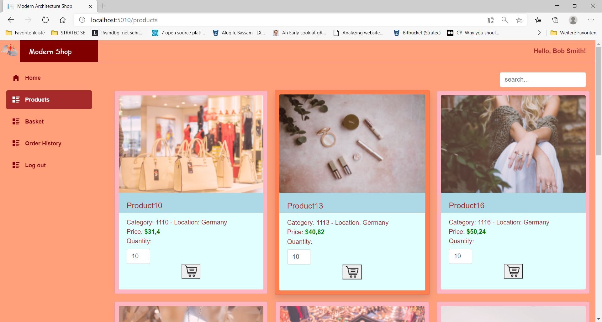
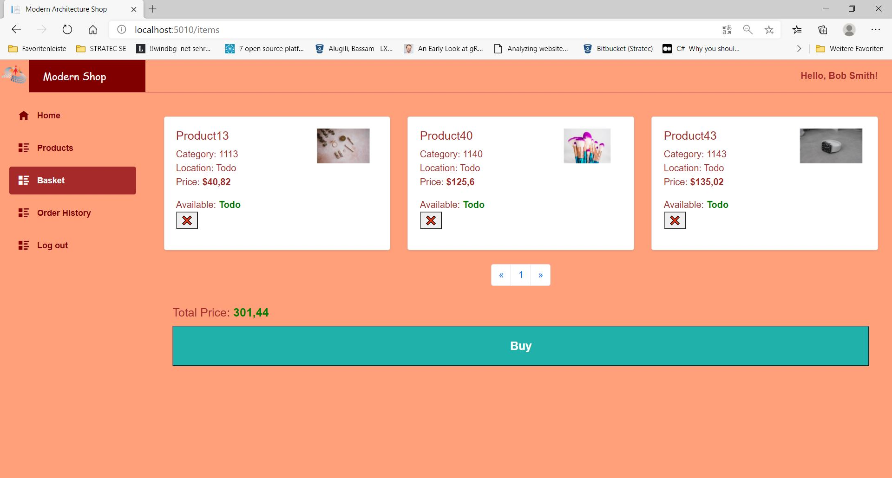
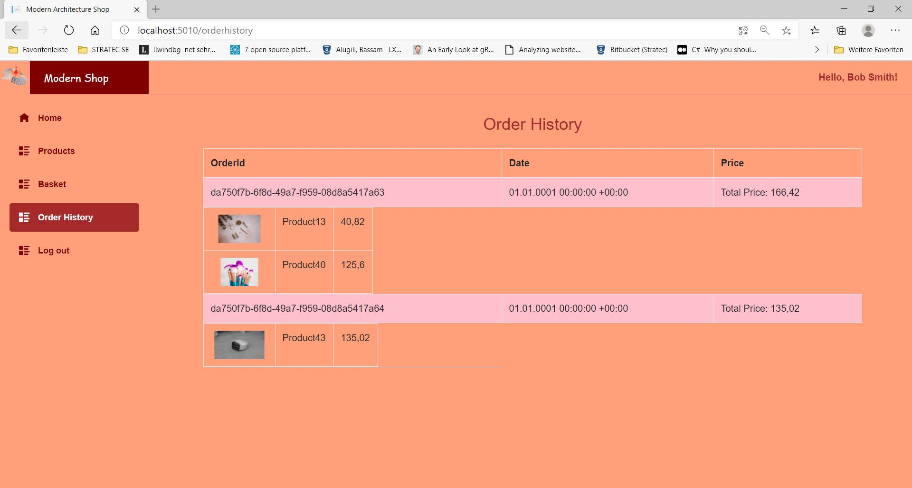
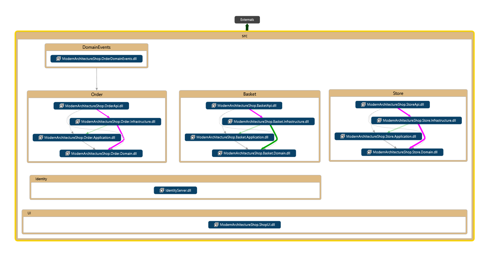
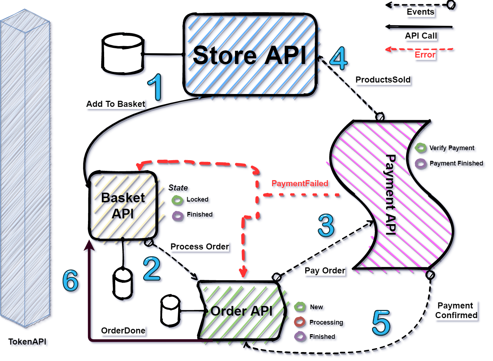
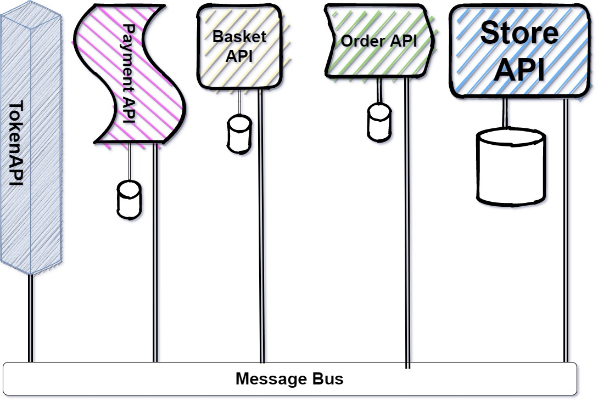

# [Quick Start](https://github.com/alugili/ModernArchitectureShop/wiki/QuickStart)
# [Modern Architecture Shop Part I(Article)](https://github.com/alugili/ModernArchitectureShop/wiki/Modern-Architecture-Shop-Article-Part-I)
# [Modern Architecture Shop Part II(Article)](https://github.com/alugili/ModernArchitectureShop/wiki/Modern-Architecture-Shop-Article-Part-II)

Microservices Online Shop
======================

Microservices Online shop is a Modern Architecture Shop that is cleanly designed and based on.NET lightweight technologies. The shop has two build variations. The first variant is the classic Microservices Architectural style. The second one is with Dapr to get the most out of its infrastructure and achieve our noble goal of building a highly scalable application with clean architecture and clean code. The shop is still in the development phase, for example, user interface, user authentication, catalog service, basket service, and order service. The work in the payment service is still in progress.
 
**Login Service**  

**Catalog/Product service**  

**Basket/Card Service**  

**Payment Service**  

**Order History**  

As you see, most of the views are done! One important thing is still missing, and that is the payment service. I am using Stripe API for this job.

You can run the shop as standalone services or on the Docker containers. Kubernetes stuff still under work. I have tried to simplify the build and start the application. To do that, you have to do it in few steps. 

If you want to join the GitHub project development process, you are welcome to write to me please a request, and you are welcome on the board! 
Much work still open in the:

-	Blazor UI
-	IdentityServer 4 
-	Kubernetes

**Dependencies**  

I have generated the architecture dependencies with Visual Studio 2019, and I have ordered them from the bottom to the top, as seen in the figure below.

Currently, I am using the fantastic tool “NDepend”  to find code and architecture problems.

**Clean Architecture**

Clean Architecture is the key to Loosely-Coupled-Application. It allows you to decouple the application from the infrastructure completely.

**Clean Architecture Separates**  

•	User Interface  
•	Database  
•	Use Cases  
•	Domain  

*User interface*  

Store.UI is the frontend of the shop, and it contains the shop user interface stuff. 

*Database*

Each service owns its database (StoreDb, BasketDb, OrderDb, UserDb). 

*Use Cases*  

I have also divided each domain service into four parts or assemblies:

*Business logic interfaces - Use cases*  

It contains the business logic interfaces; for example, StoreApplication.dll contains the interfaces for the  Store service.

*Infrastructure*  

It contains the implementation of the use case or business logic.

*Domain*  

It contains the Domains entities or POCOs.

*API*  

It contains the Web API stuff.

I have tried to keep the code as I can compact and readable. The core design concept is the separation of concerns in a clean way. 

**The shop Software Architecture**  

*Classic architectural style*  

In the classic architectural style, I am using the classic domain-driven design and microservices design. Where each domain service calling the other service directly (Web API)

     Classic architectural style

**Highly Scalable Design**  

I am using the Dapr infrastructure in this style, for example, RabbitMQ - message bus, Redis for the state management, and other Dapr stuff, which allows me to achieve the highly scalable architecture.

      Highly Scalable Design  

**How can you test the Modern Shop?**
  
**Required**   

https://docs.microsoft.com/en-us/visualstudio/releases/2019/release-notes-preview Visual Studio 2019
https://www.docker.com/products/docker-desktop Docker Desktop

**First Approach with Visual Studio**  

Build and Start the Shop  

1. Install tye
`dotnet tool install -g Microsoft.Tye --version "0.5.0-*" --add-source https://pkgs.dev.azure.com/dnceng/public/_packaging/dotnet5/nuget/v3/index.json`

2. Start tye-min.yaml in console
`tye run tye-min.yaml`

3. Open the solution file **ModernArchitectureShop.sln** with latest Visual Studio 2019 preview.
 
4. Set the Startup projects as shown below
 

 
5. PRESS **F5** and enjoy it!   
 
**The Second Approach run the Shop with Dapr**   
Alternatively, to Visual Studio 2019
 
1. Install Tye   
`dotnet tool install -g Microsoft.Tye --version "0.5.0-*" --add-source https://pkgs.dev.azure.com/dnceng/public/_packaging/dotnet5/nuget/v3/index.json`

2. Start tye-min.yaml in the console
`tye run tye-min.yaml`

3. Install Dapr   
`powershell -Command "iwr -useb https://raw.githubusercontent.com/dapr/cli/master/install/install.ps1 | iex"`

4. Execute dapr_start.ps1 in the PowerShell    
`./dapr_start.ps1`

**Third Approach run it with Tye**

1. Tye install    
 
This will install the newest available build from our CI.    

`dotnet tool install -g Microsoft.Tye --version "0.5.0-*" --add-source https://pkgs.dev.azure.com/dnceng/public/_packaging/dotnet5/nuget/v3/index.json`

If you already have a build installed and you want to update, replace install with update    
`dotnet tool update -g Microsoft.Tye --version "0.5.0-*" --add-source https://pkgs.dev.azure.com/dnceng/public/_packaging/dotnet5/nuget/v3/index.json`

2. Execute the tye command     
`tye run`   

**Summary**

Modern Architecture Shop is a clean-lightweight .NET and scalable application. Keep your eye on the Road Map (watch it on GitHub). The next version contains minimal features set so that you can pay an order with a Credit Card.
The Shop manager service is also in my plan, which allows you to manage the shop users and administrators and the shop products. Recommendation service and all other AI services or features, I provide them later.

