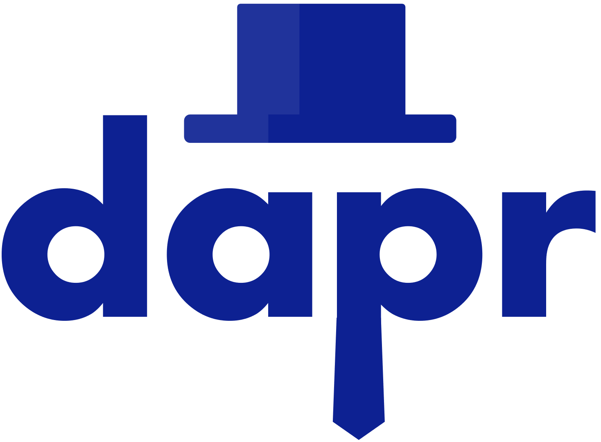
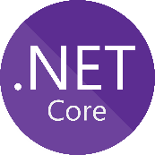
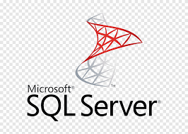
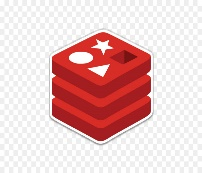

Tech Stacks

{width="1.0708661417322836in"
height="0.7874015748031497in"}{width="0.7874015748031497in"
height="0.7874015748031497in"}{width="0.7874015748031497in"
height="0.7874015748031497in"}{width="1.0984251968503937in"
height="0.7874015748031497in"}{width="0.7874015748031497in"
height="0.7874015748031497in"}{width="1.1062992125984252in"
height="0.7874015748031497in"}{width="0.7874015748031497in"
height="0.7874015748031497in"}{width="0.9166666666666666in"
height="0.7868055555555555in"}{width="1.1496062992125984in"
height="0.7874015748031497in"}

\- Dapr

\- Visual Studio 2019 last preview

\- .Net Core 5

\- Blazor

\- Identityserver4

\- Entity Framework Core

\- SQL Server /MongoDB Todo

\- Docker

\- Kubernetes

\- Redis (pub-sub & state store)

\- Serilog

\- Tye

\- MediatR

\- AutoMapper

\- FluentValidation
